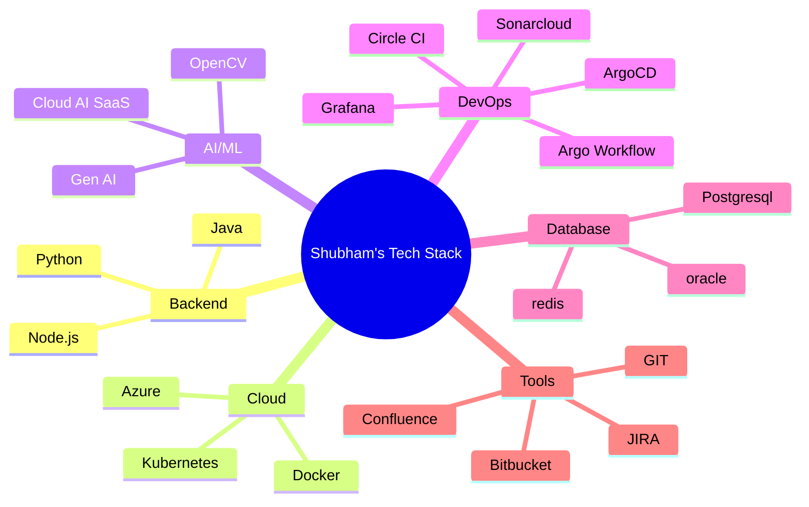

<div align="center">

#  Shubham Jain  
#### *10-Year Tech Generalist | AI/Cloud Solutions Architect | Research-Powered Problem Solver | AI Innvator*  

</div>


<div align="center">
  
📍 **Hong Kong** | 📧 [jainshubham1809@gmail.com](mailto:jainshubham1809@gmail.com) | 📞 +852 56187430  
🔗 [](https://www.linkedin.com/in/jainshubham1809/) | [](https://github.com/shubham1809) 

</div>

---

## 🧠 **My Tech Superpowers**  

<div align="center">
  
| **Problem Solving** | **Technical Range** | **Business Impact** |
|---------------------|---------------------|---------------------|
|  Solved 100+ production blockers |  15+ tech stacks mastered |  35% cost reduction via cloud migrations |
|  IEEE-published researcher |  Built AI prototypes since 2016 |  8 years client-facing experience |

</div>

---

## 🛠 **Technical Arsenal**  



---

## 🌟 **Career Highlights**  

###  **Pinnacle Achievements**  
- **AI Pioneer**: Developed facial authentication systems 5 years before industry adoption  
- **System Whisperer**: Reduced API latency by 40% through architectural optimizations  
- **Research Cred**: Published robotics algorithm in [IEEE Spain Conference](https://ieeexplore.ieee.org/document/7125564)
- **POC**: Solved Real Retail use case using AI Technology(Scan and GO, Search By Image, Customer Demographic etc.)
- **Solution Design**: Designed 10+ Applications using Node JS Stack  

###  **Experience Snapshot**  
```diff
+ Infosys Hong Kong (Sep 2022-Present)
! Led cloud migration saving $250K/year
+ Nagarro India (Apr 2022 - Aug 2022)
! Automated health insurance claims for 1M+ users
+ Infosys Hongkong (Mar 2019- Mar 2022)
! Automated health insurance claims for 1M+ users
+ Infosys India (Aug 2015- Mar 2019)
! Automated health insurance claims for 1M+ users
```

---

## 🚀 **What Makes Me Different**  

<table>
<tr>
<td width="60%">

**🔧 Generalist Advantage**  
```python
def solve(problem):
    if problem in [Backend, Cloud, AI, DevOps]:
        return optimal_solution() # My sweet spot
```

</td>
<td width="40%">

**🎯 Core Philosophy**  
> *"Understand the business first,  
> then weaponize technology"*

</td>
</tr>
</table>

---

## 📈 **Current Focus Areas**  

<div align="center">
  
| **AI Exploration** | **Tech Deep Dives** | **Process Innovation** |
|--------------------|---------------------|------------------------|
| Generative AI for retail forecasting | Quantum computing basics | DevEx optimization |
| Edge AI deployments | WASM performance tuning | AI-augmented Agile |

</div>

---

## 📫 **Let's Build Something Remarkable**  

[](mailto:jainshubham1809@gmail.com)  
[](https://calendly.com/yourlink)  

  

[](https://github.com/yourusername/yourrepo/raw/main/README.md?export=pdf)
